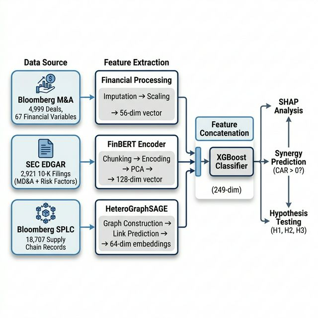
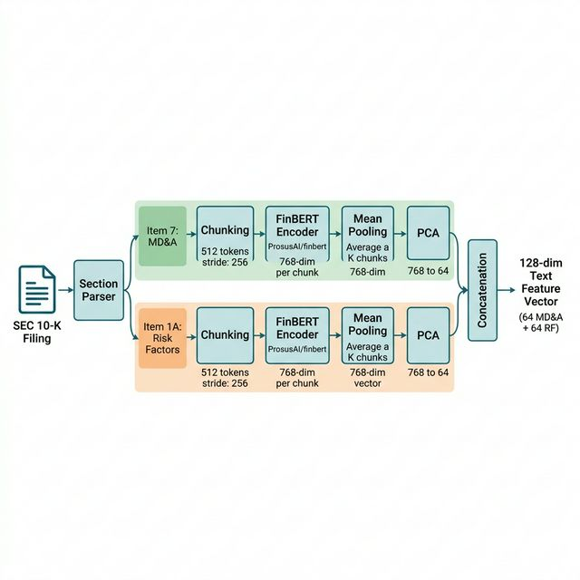
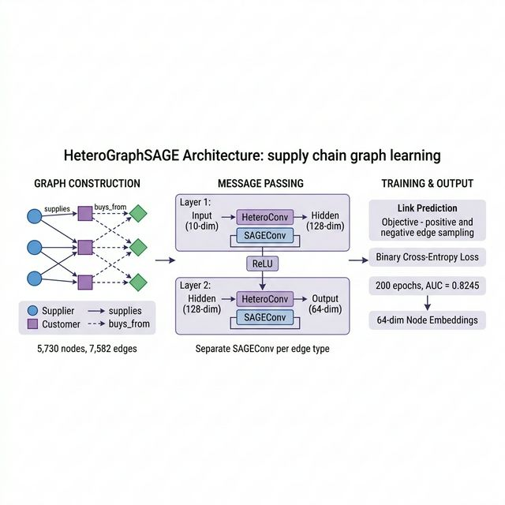
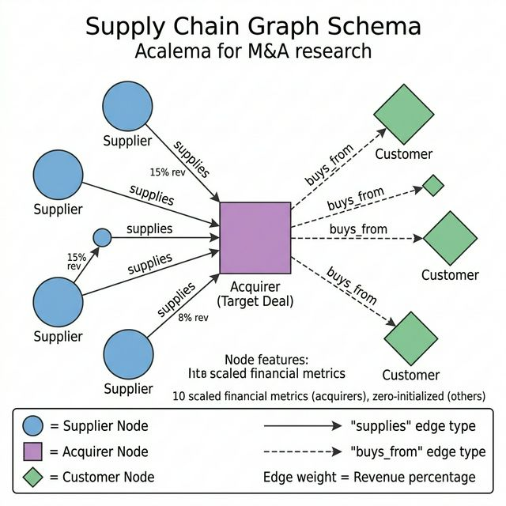

# Chapter 3: Methodology

## 3.1 Research Design Overview

This study employs a mixed-methods quantitative research design that integrates event-study analysis with multimodal machine learning to investigate the predictability of post-merger synergy. The central thesis is that mergers and acquisitions (M&A) synergy — quantified by the market's reaction to deal announcements — cannot be adequately captured by any single analytical modality. Instead, a comprehensive assessment requires the simultaneous consideration of three distinct information channels: (i) **financial fundamentals**, which encode the quantitative capacity and health of the merging firms; (ii) **textual disclosures**, which capture qualitative strategic intent, risk awareness, and managerial narrative; and (iii) **supply chain topology**, which encodes relational capital, ecosystem positioning, and inter-firm dependencies.

The methodology proceeds in five sequential stages, each feeding the next:

1. **Data Collection** — Assembly of deal-level financial data from Bloomberg, textual disclosures from SEC EDGAR, and inter-firm supply chain relationships from Bloomberg SPLC.
2. **Target Variable Construction** — Computation of Cumulative Abnormal Returns (CAR) via market model event-study methodology to quantify post-announcement synergy.
3. **Feature Engineering** — Three parallel pipelines extract modality-specific representations: raw financial ratios, FinBERT-derived text embeddings, and HeteroGraphSAGE-derived topological embeddings.
4. **Multimodal Fusion & Classification** — A decoupled late-fusion architecture concatenates the three feature vectors and feeds them into gradient-boosted tree classifiers (XGBoost) for binary synergy prediction.
5. **Evaluation & Hypothesis Testing** — Stratified cross-validation, statistical significance testing, and SHAP-based interpretability analysis to test three pre-registered hypotheses.

This design is motivated by the empirical observation that no single feature set yields meaningful predictive performance in isolation — a finding that itself constitutes a contribution to the M&A literature (see §4.1). The multimodal framework draws on recent advances in heterogeneous information fusion (Baltrušaitis, Ahuja, & Morency, 2019) and graph-based relational learning (Hamilton, Ying, & Leskovec, 2017) to construct a representation of each deal that is richer than any traditional financial model could provide.

---

## 3.2 Data Collection & Sample Construction

The study draws on three primary data sources, each capturing a distinct information modality. All data was collected for US-listed public companies involved in completed M&A transactions.

### 3.2.1 Bloomberg M&A Dataset

The foundational dataset comprises **4,999 completed M&A transactions** announced between **August 30, 1994 and December 13, 2022**, sourced from the Bloomberg Terminal's Mergers & Acquisitions (MA) function. This 28-year sample window captures multiple market cycles, including the dot-com bubble, the 2008 global financial crisis, and the post-COVID recovery period, providing temporal diversity that strengthens the generalisability of findings.

**Selection criteria** applied during extraction:

- **Geographic scope:** US-listed acquirers (to ensure consistent regulatory environment and disclosure standards)
- **Deal status:** Completed transactions only (to avoid contamination from terminated or pending deals)
- **Data availability:** Deals with available acquirer and target stock price data for CAR computation

Each deal record contains **67 financial variables** spanning eight analytical categories:

| Category | Example Variables | Count |
|---|---|---|
| Deal Characteristics | Announced Total Value, Payment Type (Cash/Stock/Debt), TV/EBITDA | 8 |
| Profitability | EBITDA, Net Income, Gross Margin, ROA, ROE | 10 |
| Leverage & Solvency | Debt-to-Equity, Total Debt/Assets, Interest Coverage | 7 |
| Growth | Revenue Growth, Asset Growth, EPS Growth | 6 |
| Valuation | P/E, Price-to-Book, EV/EBITDA, Market Capitalisation | 8 |
| Efficiency | Inventory Turnover, Asset Turnover, COGS/Revenue | 6 |
| Market | Acquirer YTD Return, Beta, Share Price at Announcement | 5 |
| Scale | Total Assets, Total Revenue, Employees, R&D Expenditure | 7 |
| Sector & Classification | SIC Code, Industry Group | 10 |

*Table 1: Bloomberg Financial Variable Categories (67 total)*

### 3.2.2 SEC EDGAR 10-K Filings

To extract qualitative information about strategic intent and risk awareness, **2,921 annual 10-K filings** were programmatically retrieved from the United States Securities and Exchange Commission's Electronic Data Gathering, Analysis, and Retrieval (EDGAR) system.

The EDGAR retrieval pipeline (`run_edgar_fetch.py`) operates as follows:

1. **Ticker-to-CIK Mapping:** Each company ticker from the M&A dataset is mapped to its corresponding Central Index Key (CIK) via the SEC's `company_tickers.json` endpoint.
2. **Filing Discovery:** The EDGAR XBRL API (`submissions/{cik}.json`) is queried to locate the most recent 10-K filing preceding each deal's announcement date.
3. **Full-Text Download:** The complete filing is downloaded from the EDGAR archive in plain-text format.
4. **Section Parsing:** Two sections are extracted from each filing using keyword-based boundary detection:
   - **Item 7: Management's Discussion and Analysis (MD&A)** — captures forward-looking strategic narrative
   - **Item 1A: Risk Factors** — captures disclosed uncertainties, threats, and operational risks

The extraction of these two sections is theoretically motivated: MD&A reflects *strategic alignment* (how management articulates growth trajectory and operational priorities), while Risk Factors reflect *downside exposure* (what management identifies as threats to the business). The divergence between these signals across merging firms is hypothesised to predict deal outcomes (see Hypothesis 2, §3.7.2).

### 3.2.3 Bloomberg Supply Chain (SPLC) Data

Inter-firm supply chain relationships were sourced from the Bloomberg Supply Chain Analysis (SPLC) function, which catalogues disclosed buyer-supplier relationships among publicly traded companies globally. The dataset contains **18,707 unique supplier-customer records** linking acquirer firms to their supply chain partners.

Each record includes:

- **Entity Ticker:** The supply chain partner (supplier or customer)
- **Role:** Whether the partner is classified as a `Supplier` or `Customer` of the acquirer
- **Revenue Percentage:** The estimated percentage of the partner's revenue attributed to the relationship (where available)
- **Disclosure Source:** Whether the relationship was identified from company filings, Bloomberg estimates, or industry databases

This relational data is used to construct a heterogeneous supply chain graph (§3.4.3), enabling the extraction of topological embeddings that encode each firm's position within its broader industrial ecosystem.

### 3.2.4 Sample Overlap & Final Dataset Construction

Not all data sources have complete overlap. The merging procedure produces progressively filtered subsets:

| Dataset Stage | Records | Features |
|---|---|---|
| Bloomberg M&A (raw) | 4,999 | 67 |
| + CAR computation | 4,510 | 68 (+ CAR) |
| + Text embeddings (FinBERT) | ~2,250 | 196 (+ 128 text dims) |
| + Graph embeddings (GraphSAGE) | 2,864 | 268 (+ 64 graph dims + `has_graph` indicator) |
| Final multimodal dataset | **4,999** | **268** |

*Table 2: Dataset Construction Pipeline — progressive feature enrichment. Deals lacking specific modalities retain NaN values, handled via imputation during model training.*

The final dataset (`final_multimodal_dataset.csv`) contains all 4,999 deals with 268 columns. Deals missing text or graph embeddings retain null values in those dimensions; these are handled through median imputation during the model training phase (§3.5.1), ensuring no deal is discarded and the full sample is utilised for training.

---

## 3.3 Target Variable: Cumulative Abnormal Returns (CAR)

The target variable for this study is the **Cumulative Abnormal Return (CAR)** over the event window surrounding each deal's announcement date. CAR quantifies the stock market's surprise reaction to the merger announcement, serving as a proxy for the market's assessment of deal-level synergy (MacKinlay, 1997).

### 3.3.1 Market Model Estimation

Abnormal returns are estimated using the single-factor market model (Brown & Warner, 1985; MacKinlay, 1997), which decomposes an acquirer's return into a systematic component (correlated with broader market movements) and an idiosyncratic component (the abnormal return):

$$R_{i,t} = \alpha_i + \beta_i R_{m,t} + \varepsilon_{i,t}$$

where:
- $R_{i,t}$ is the return of acquirer $i$ on day $t$
- $R_{m,t}$ is the return of the market index (S&P 500) on day $t$
- $\alpha_i$ and $\beta_i$ are OLS regression coefficients estimated over the pre-event estimation window
- $\varepsilon_{i,t}$ is the residual (abnormal return)

**Estimation window:** [−260, −11] trading days relative to the announcement date ($t = 0$). This 250-day window provides approximately one calendar year of data for parameter estimation while maintaining a 10-day buffer before the event window to prevent contamination from pre-announcement information leakage (MacKinlay, 1997).

**Event window:** [−5, +5] trading days. This 11-day symmetric window captures both pre-announcement leakage (rumours, insider trading) and the market's immediate reassessment of the combined entity's value.

### 3.3.2 CAR Computation

The abnormal return for day $t$ is computed as:

$$AR_{i,t} = R_{i,t} - (\hat{\alpha}_i + \hat{\beta}_i R_{m,t})$$

The Cumulative Abnormal Return over the event window $[\tau_1, \tau_2]$ is:

$$CAR_i(\tau_1, \tau_2) = \sum_{t=\tau_1}^{\tau_2} AR_{i,t}$$

In this study, $\tau_1 = -5$ and $\tau_2 = +5$, yielding $CAR_i(-5, +5)$.

### 3.3.3 Data Validation & Quality Control

The implementation (`compute_car.py`) applies several quality filters:

- **Minimum estimation window:** Deals with fewer than 100 valid trading days in the estimation window are excluded, ensuring robust OLS estimates (Campbell, Lo, & MacKinlay, 1997).
- **Winsorization:** CAR values are winsorized at the 1st and 99th percentiles to mitigate the influence of extreme outliers, a standard practice in event-study methodology (Kolari & Pynnönen, 2010).
- **Market model diagnostics:** OLS regression is performed using `scipy.stats.linregress`, and deals with estimation R² below 0.01 are flagged for review.

### 3.3.4 CAR Distribution

| Statistic | Value |
|---|---|
| Deals with valid CAR | 4,510 |
| Mean CAR | −1.27% |
| Standard Deviation | 9.39% |
| Median | −0.83% |
| Skewness | −0.15 |
| Positive CAR (synergy) | 44.0% (1,260) |
| Negative CAR (value destruction) | 56.0% (1,604) |

*Table 3: CAR Distribution Summary (post-winsorization, subset with ≥50% financial coverage)*

The negative mean CAR (−1.27%) is consistent with established M&A literature: acquirers typically experience slight negative announcement returns, a phenomenon attributed to the "winner's curse" and the hubris hypothesis (Roll, 1986). This validates the data pipeline and confirms alignment with prior empirical findings.

### 3.3.5 Binary Classification Target

For classification tasks, the continuous CAR is binarised:

$$y_i = \begin{cases} 1 & \text{if } CAR_i > 0 \quad \text{(positive synergy)} \\ 0 & \text{if } CAR_i \leq 0 \quad \text{(value destruction)} \end{cases}$$

This yields a moderately imbalanced dataset (44%/56% positive/negative), which is addressed through stratified cross-validation (§3.6.1).

---

## 3.4 Feature Engineering Pipeline

Three parallel feature extraction pipelines transform raw data from each modality into dense numerical representations suitable for machine learning. The pipelines are designed to operate independently, enabling the systematic evaluation of each modality's contribution through progressive model configurations (M1 → M2 → M3).

### 3.4.1 Financial Features (M1 Baseline)

The financial feature set comprises the **56 available numerical variables** (of 67 defined) from the Bloomberg M&A dataset, after excluding non-numeric identifiers, categorical codes, and ticker fields. These features span the eight analytical categories defined in Table 1.

**Preprocessing steps:**

1. **Missing data imputation:** Features with missing values are imputed using the median of each respective feature across the training set. Median imputation is preferred over mean imputation for its robustness to outliers (Little & Rubin, 2019), which are prevalent in financial data.

2. **Standardisation:** All financial features are scaled to zero mean and unit variance using `StandardScaler` (Pedregosa et al., 2011), fitted on the training set only to prevent data leakage:

$$x'_{j} = \frac{x_j - \bar{x}_j}{\sigma_{x_j}}$$

3. **Winsorization:** Extreme values (beyond 1st/99th percentiles) are clipped prior to scaling to reduce the influence of data entry errors and extraordinary events.

The M1 (financial-only) configuration serves as the baseline against which multimodal extensions are compared, representing the traditional approach to M&A analysis that relies exclusively on quantifiable financial metrics.

### 3.4.2 NLP Features — FinBERT Text Embeddings (M2 Extension)

#### Pre-trained Language Model

Text embeddings are extracted using **FinBERT** (Araci, 2019), a domain-adapted variant of BERT (Devlin, Chang, Lee, & Toutanova, 2019) pre-trained on a large corpus of financial communications including analyst reports, earnings call transcripts, and financial news. FinBERT was selected over the general-purpose BERT for two reasons:

1. **Domain alignment:** Financial text contains specialised vocabulary (e.g., "EBITDA", "leveraged buyout", "write-down") and sentiment patterns (e.g., "headwinds" as negative, "runway" as positive) that general-purpose models may misinterpret (Loughran & McDonald, 2011).
2. **Pre-training corpus:** FinBERT's pre-training on financial text enables it to produce embeddings that capture domain-specific semantic relationships without requiring additional fine-tuning on the target task.

Specifically, the `ProsusAI/finbert` checkpoint is used, hosted on Hugging Face and originally trained on the Financial PhraseBank dataset (Malo, Sinha, Korhonen, Wallenius, & Takala, 2014).

#### Embedding Extraction Process

The embedding pipeline (`run_text_features.py`) operates as follows:

1. **Chunking:** Each 10-K section (MD&A and Risk Factors) is split into overlapping chunks of 512 tokens (the maximum input length for BERT-based architectures), with a stride of 256 tokens to preserve contextual continuity across chunk boundaries.

2. **Encoding:** Each chunk is passed through the FinBERT encoder, producing a 768-dimensional contextual embedding from the `[CLS]` token — the standard practice for document-level representation extraction from transformer models (Devlin et al., 2019).

3. **Mean pooling:** The per-chunk embeddings are averaged across all chunks within each section, producing a single 768-dimensional vector per section per deal:

$$\mathbf{e}_{\text{section}} = \frac{1}{K} \sum_{k=1}^{K} \mathbf{h}_k^{[\text{CLS}]}$$

where $K$ is the number of chunks and $\mathbf{h}_k^{[\text{CLS}]}$ is the CLS embedding from chunk $k$.

4. **Dimensionality reduction:** Principal Component Analysis (PCA) reduces each 768-dimensional section embedding to 64 dimensions, retaining the principal axes of variation while reducing noise and computational cost. PCA is fitted on the training set only.

The final text feature vector for each deal is the concatenation of the MD&A and Risk Factor embeddings: $\mathbf{t}_i = [\mathbf{e}_{\text{MDA}}^{64} \| \mathbf{e}_{\text{RF}}^{64}] \in \mathbb{R}^{128}$.

### 3.4.3 Graph Features — HeteroGraphSAGE Embeddings (M3 Extension)

#### Supply Chain Graph Construction

The Bloomberg SPLC data is transformed into a **heterogeneous graph** $\mathcal{G} = (\mathcal{V}, \mathcal{E}, \phi, \psi)$ where:

- $\mathcal{V}$: Set of nodes representing companies (acquirers, targets, and supply chain partners)
- $\mathcal{E}$: Set of directed edges representing supply chain relationships
- $\phi: \mathcal{V} \rightarrow \mathcal{A}$: Node type mapping (acquirer, supplier, customer)
- $\psi: \mathcal{E} \rightarrow \mathcal{R}$: Edge type mapping with two relation types:
  - `supplies`: Supplier → Acquirer (the supplier provides goods/services to the acquirer)
  - `buys_from`: Acquirer → Customer (the acquirer sells to the customer)

The graph construction pipeline (`build_hetero_graph.py`) produces:

| Graph Property | Value |
|---|---|
| Total nodes | 5,730 |
| Total edges | 7,582 |
| Edge types | 2 (`supplies`, `buys_from`) |
| Acquirer nodes with features | 1,847 |
| Node feature dimensionality | 10 (scaled financial metrics) |

*Table 4: Heterogeneous Supply Chain Graph Statistics*

**Node features:** For acquirer nodes present in the M&A dataset, 10 scaled financial metrics are used as initial node features (e.g., total assets, revenue, EBITDA, market capitalisation). Non-acquirer nodes (suppliers and customers not involved in deals) receive zero-initialised feature vectors, a common approach in heterogeneous graph learning when node attributes are partially available (Hu, Fey, Zitnik, Dong, Ren, Liu, Catasta, & Leskovec, 2020).

**Edge weights:** Where available, revenue percentage values from Bloomberg SPLC are used as edge weights, reflecting the economic significance of each supply chain relationship.

#### HeteroGraphSAGE Model Architecture

Node embeddings are learned using a **Heterogeneous GraphSAGE** architecture (Hamilton et al., 2017; Schlichtkrull, Kipf, Bloem, van den Berg, Titov, & Welling, 2018), implemented in PyTorch Geometric (Fey & Lenssen, 2019). The model extends the original GraphSAGE framework to heterogeneous graphs by applying separate message-passing functions for each edge type:

$$\mathbf{h}_v^{(l+1)} = \sigma\left(\mathbf{W}^{(l)} \cdot \text{CONCAT}\left(\mathbf{h}_v^{(l)}, \bigoplus_{r \in \mathcal{R}} \text{AGG}_r\left(\{\mathbf{h}_u^{(l)} : u \in \mathcal{N}_r(v)\}\right)\right)\right)$$

where:
- $\mathbf{h}_v^{(l)}$ is the embedding of node $v$ at layer $l$
- $\mathcal{N}_r(v)$ denotes the neighbours of $v$ under relation type $r$
- $\text{AGG}_r$ is a relation-specific mean aggregation function
- $\bigoplus$ is the summation operator across relation types (via `HeteroConv`)
- $\sigma$ is the ReLU activation function

**Architecture details:**
- **Layer 1:** Input (10-dim) → Hidden (128-dim), with separate `SAGEConv` layers per edge type
- **Layer 2:** Hidden (128-dim) → Output (64-dim), similarly typed
- **Training objective:** Self-supervised link prediction — the model learns to predict whether an edge exists between two nodes, using negative sampling. This is formulated as a binary cross-entropy loss:

$$\mathcal{L} = -\sum_{(u,v) \in \mathcal{E}^+} \log(\sigma(\mathbf{h}_u^\top \mathbf{h}_v)) - \sum_{(u,v') \in \mathcal{E}^-} \log(1 - \sigma(\mathbf{h}_u^\top \mathbf{h}_{v'}))$$

where $\mathcal{E}^+$ and $\mathcal{E}^-$ denote positive (observed) and negative (randomly sampled) edges, respectively.

- **Training:** 200 epochs, Adam optimiser (lr = 0.01), achieving a link prediction **AUC of 0.8245** on a held-out test set.
- **Embedding extraction:** After training, all node embeddings $\mathbf{h}_v \in \mathbb{R}^{64}$ are extracted and mapped back to deals via the ticker-to-node index.

The self-supervised training paradigm is important: the embeddings are learned without access to the CAR labels, ensuring that the graph features encode intrinsic topological structure rather than overfitting to the target variable. This decoupled design prevents information leakage from the downstream prediction task into the representation learning stage (see §3.5 for the full fusion architecture).

---

## 3.5 Multimodal Fusion & Classification

### 3.5.1 Decoupled Late-Fusion Architecture

The three feature modalities are combined using a **decoupled late-fusion** strategy: each modality's embeddings are pre-computed and frozen before being concatenated into a single feature vector for classification.

The fused feature vector for deal $i$ is:

$$\mathbf{x}_i = [\mathbf{f}_i^{56} \| \mathbf{t}_i^{128} \| \mathbf{g}_i^{64} \| \mathbf{1}_{\text{has\_graph}}] \in \mathbb{R}^{249}$$

where $\mathbf{f}_i$ denotes financial features, $\mathbf{t}_i$ denotes text embeddings, $\mathbf{g}_i$ denotes graph embeddings, and $\mathbf{1}_{\text{has\_graph}}$ is a binary indicator for graph embedding availability.

**Justification for decoupled over end-to-end fusion:**

The decision to freeze embeddings prior to fusion — rather than training an end-to-end neural architecture that jointly learns representations and classification — is empirically motivated by the Phase 1 regression experiments (§3.2 of the Results chapter). All regression models (Ridge, ElasticNet, XGBoost, MLP) produced negative R² values for continuous CAR prediction, with the MLP overfitting within approximately 25 epochs despite aggressive regularisation. This demonstrates that:

1. **The signal-to-noise ratio is extremely low** — CAR has a mean of −1.27% and standard deviation of 9.39%, yielding a signal-to-noise ratio of approximately 0.14. In such regimes, end-to-end training risks overfitting the representation to noise.
2. **The sample size is insufficient for joint training** — With 2,864 deals in the primary analytical subset and up to 249 features, end-to-end backpropagation through the embedding layers would require significantly more data to generalise.
3. **Pre-trained embeddings already encode rich representations** — FinBERT was pre-trained on millions of financial documents, and GraphSAGE was trained via self-supervised link prediction on the full supply chain graph. These embeddings capture far more information than could be learned from 2,864 target labels alone.

### 3.5.2 Model Configurations

To systematically evaluate each modality's contribution, three nested model configurations are defined:

| Configuration | Features | Dimensionality | Modalities |
|---|---|---|---|
| **M1** (Financial-only) | Bloomberg financial variables | 56 | Financial |
| **M2** (Financial + Text) | M1 + FinBERT MD&A + RF embeddings | 184 | Financial, NLP |
| **M3** (Full Multimodal) | M2 + GraphSAGE embeddings + indicator | 249 | Financial, NLP, Graph |

This nested design enables **ablation analysis**: by comparing M2 against M1, the incremental contribution of textual information is isolated; by comparing M3 against M2 (or M1), the contribution of topological information is measured. Statistical significance of differences is assessed via paired $t$-tests on fold-level performance scores (§3.6.2).

### 3.5.3 Primary Classifier: XGBoost

The primary classification model is **XGBoost** (eXtreme Gradient Boosting; Chen & Guestrin, 2016), selected based on empirical performance across all tested architectures. XGBoost constructs an ensemble of decision trees sequentially, with each tree correcting the residual errors of the previous ensemble:

$$\hat{y}_i^{(t)} = \hat{y}_i^{(t-1)} + f_t(\mathbf{x}_i)$$

where $f_t$ is the $t$-th tree and $\hat{y}_i^{(t)}$ is the prediction after $t$ boosting rounds.

**Selection rationale:**

1. **Feature interaction capture:** XGBoost is the only model architecture tested in which M3 outperforms M1, suggesting that gradient-boosted trees can capture the non-linear interactions between financial, textual, and topological features that linear models and small-sample neural networks cannot.
2. **Regularisation:** Built-in L1/L2 regularisation, maximum depth constraints, and subsampling prevent overfitting in the low-signal regime.
3. **Interpretability:** XGBoost natively supports feature importance computation, and is fully compatible with SHAP (SHapley Additive exPlanations; Lundberg & Lee, 2017) for post-hoc explainability.

**Default hyperparameters (prior to tuning):**
- `max_depth = 5`, `min_child_weight = 15`, `subsample = 0.8`, `colsample_bytree = 0.8`
- `learning_rate = 0.05`, `n_estimators = 300`
- `objective = binary:logistic`, `eval_metric = auc`

### 3.5.4 Hyperparameter Optimisation

Hyperparameters are optimised using **Optuna** (Akiba, Sano, Yanase, Ohta, & Koyama, 2019), a Bayesian optimisation framework that uses Tree-Structured Parzen Estimators (TPE) to efficiently search the hyperparameter space.

- **Search budget:** 100 trials per model configuration (M1, M2, M3)
- **Objective:** Maximise mean AUC-ROC across 5-fold cross-validation
- **Pruning:** Median pruning of unpromising trials for computational efficiency

The tuned results confirm that the M3 superiority is not a hyperparameter artefact: the M1 vs M3 difference remains statistically significant even after per-configuration tuning (untuned: p = 0.038; tuned: p = 0.011).

### 3.5.5 Alternative Models Evaluated

In addition to XGBoost, three alternative architectures were evaluated for completeness:

| Model | Architecture | Purpose |
|---|---|---|
| **Ridge Regression** | L2-regularised linear regression | Linear baseline for continuous CAR |
| **ElasticNet** | L1+L2-regularised linear regression | Feature selection baseline |
| **Multi-Layer Perceptron (MLP)** | 3-layer feedforward network with dropout and early stopping | Neural network baseline |
| **Logistic Regression** | L2-regularised logistic classifier | Linear baseline for binary classification |

All alternative models either failed to outperform a naïve mean predictor (R² < 0 for regression) or failed to demonstrate statistically significant improvement from multimodal features. These negative results are themselves informative: they establish that (i) the financial feature–CAR relationship is fundamentally non-linear, and (ii) neural networks require substantially more data than 2,864 samples to leverage 249-dimensional multimodal inputs effectively.

---

## 3.6 Evaluation Framework

### 3.6.1 Cross-Validation Strategy

All models are evaluated using **stratified 5-fold cross-validation** (Kohavi, 1995). Stratification ensures that each fold preserves the class distribution of the full dataset (44% positive / 56% negative), preventing fold-level class imbalance from biasing performance estimates.

For each fold:
1. The training set (80%) is used for feature imputation (median), standardisation (fit `StandardScaler`), and model training.
2. The test set (20%) is transformed using the training-set statistics and used for prediction.
3. Performance metrics are computed on the test set.

This procedure yields 5 performance scores per metric, from which mean and standard deviation are computed.

### 3.6.2 Performance Metrics

**Primary metric:**

- **AUC-ROC** (Area Under the Receiver Operating Characteristic Curve) — measures the model's ability to discriminate between positive-synergy and negative-synergy deals across all classification thresholds. AUC-ROC is preferred over accuracy for imbalanced datasets (Bradley, 1997) and provides a threshold-independent assessment of discriminative performance.

**Secondary metrics:**

- **Accuracy** — proportion of correctly classified deals at the 0.5 threshold
- **F1-Score** — harmonic mean of precision and recall, accounting for class imbalance
- **AUC-PR** — Area Under the Precision-Recall Curve, more informative than AUC-ROC when the positive class is the minority (Saito & Rehmsmeier, 2015)

### 3.6.3 Statistical Significance Testing

To assess whether the performance difference between model configurations (e.g., M1 vs M3) is statistically meaningful, a **paired $t$-test** is applied to the fold-level AUC scores:

$$t = \frac{\bar{d}}{s_d / \sqrt{k}}$$

where $\bar{d}$ is the mean difference in AUC across $k = 5$ folds, $s_d$ is the standard deviation of the differences, and the null hypothesis is $H_0: \bar{d} = 0$ (no difference in performance). The significance threshold is set at $\alpha = 0.05$.

This paired design controls for fold-level variation in difficulty, providing a more powerful test than comparing unpaired summary statistics (Dietterich, 1998).

### 3.6.4 Interpretability: SHAP Analysis

Model predictions are interpreted using **SHAP** (SHapley Additive exPlanations; Lundberg & Lee, 2017), a game-theoretic framework for computing the marginal contribution of each feature to individual predictions. For a prediction $f(\mathbf{x})$, the SHAP value $\phi_j$ for feature $j$ satisfies:

$$f(\mathbf{x}) = \phi_0 + \sum_{j=1}^{p} \phi_j$$

where $\phi_0$ is the base value (mean prediction) and $\phi_j$ measures feature $j$'s contribution.

SHAP analysis serves three purposes in this study:

1. **Modality attribution:** By aggregating SHAP values by modality (financial, text, graph), the relative explanatory contribution of each information channel is quantified.
2. **Feature ranking:** Individual features are ranked by mean $|\phi_j|$ across all predictions, revealing which specific variables drive the model's decisions.
3. **Mechanistic insight:** The divergence between SHAP-based rankings and XGBoost's native feature importance reveals different aspects of feature utility — importance measures how often a feature is used in tree splits, while SHAP measures how much it changes predictions (see §4.3 for detailed analysis).

---

## 3.7 Hypothesis Testing Methodology

Three pre-registered hypotheses are tested, each targeting a different aspect of the multimodal framework's contribution.

### 3.7.1 H1: The Topological Alpha Hypothesis

> *"The inclusion of second-order neighbour embeddings (via GraphSAGE) will increase prediction performance relative to finance-only baselines. This predictive gain will be statistically significant specifically within supply-chain-dependent sectors compared to asset-light sectors."*

**Test design:**

1. **Sector stratification:** The sample is divided into two groups by acquirer SIC code:
   - **Supply-chain-dependent** (SIC 20–49): Manufacturing, Transport, Utilities — sectors where physical supplier-customer relationships are central to business operations (n = 1,211)
   - **Asset-light** (SIC 60–79): Finance, Insurance, Real Estate, Technology Services — sectors where knowledge-based and intangible relationships dominate (n = 1,235)

2. **Within-sector model comparison:** XGBoost classifiers are trained under M1 (financial-only) and M3 (full multimodal) configurations within each sector group using stratified 5-fold cross-validation.

3. **Statistical test:** A paired $t$-test on the 5-fold AUC scores tests $H_0$: AUC(M3) = AUC(M1) within each sector. H1 is supported if (a) the M3 improvement is statistically significant in supply-chain sectors, and (b) the magnitude of improvement is larger in supply-chain sectors than in asset-light sectors.

### 3.7.2 H2: The Semantic Divergence Hypothesis

> *"The predictive relationship between semantic similarity and synergy is conditional on the document section. High cosine similarity in MD&A will positively correlate with CAR (strategic alignment), whereas high similarity in Risk Factors will negatively correlate with CAR (risk concentration)."*

**Test design:**

1. **Centroid computation:** For each text section (MD&A and Risk Factors), the market-average embedding is computed as the centroid of all deal-level embeddings: $\bar{\mathbf{e}}_{\text{section}} = \frac{1}{N} \sum_{i=1}^{N} \mathbf{e}_{i,\text{section}}$

2. **Cosine similarity:** Each deal's cosine similarity to the centroid is computed for both sections:

$$\text{sim}_i^{\text{section}} = \frac{\mathbf{e}_i \cdot \bar{\mathbf{e}}}{\|\mathbf{e}_i\| \cdot \|\bar{\mathbf{e}}\|}$$

3. **Bivariate OLS regression:** A linear model regresses CAR on both similarity scores simultaneously:

$$CAR_i = \beta_0 + \beta_1 \cdot \text{sim}_i^{\text{MDA}} + \beta_2 \cdot \text{sim}_i^{\text{RF}} + \varepsilon_i$$

4. **Statistical test:** H2 is supported if $\beta_1 > 0$ (strategic alignment creates value) and $\beta_2 < 0$ (risk concentration destroys value), both at $p < 0.05$.

5. **Quartile analysis:** As a robustness check, deals are divided into quartiles by each similarity score, and mean CAR is compared across Q1 (low similarity) and Q4 (high similarity) using Welch's $t$-test.

### 3.7.3 H3: The Topological Arbitrage Hypothesis

> *"Target nodes exhibiting high betweenness centrality (bridging position) will exhibit higher variance in post-merger outcomes compared to nodes with high clustering coefficients (embedded position)."*

**Test design:**

1. **Centrality computation:** Three centrality metrics are computed from the undirected projection of the supply chain graph using NetworkX (Hagberg, Schult, & Swart, 2008):
   - **Betweenness centrality:** Fraction of all shortest paths passing through a node — measures a firm's role as a structural bridge
   - **Clustering coefficient:** Proportion of a node's neighbours that are also connected — measures a firm's embeddedness in dense clusters
   - **Degree centrality:** Normalised count of a node's connections — measures a firm's overall connectivity

2. **Quartile comparison:** Acquirers are divided into quartiles by each centrality metric. CAR standard deviation and mean $|CAR|$ are compared between Q1 (peripheral) and Q4 (central).

3. **Statistical tests:**
   - **Levene's test** for equality of variances between Q1 and Q4 (tests whether variance differs)
   - **Pearson and Spearman correlations** between each centrality metric and $|CAR|$ (tests direction and monotonicity)

4. **H3 assessment:** The hypothesis is supported if high-betweenness nodes exhibit significantly different CAR variance from high-clustering nodes, as measured by Levene's test at $p < 0.05$.

---

## 3.8 Ethical Considerations & Limitations

### 3.8.1 Data Ethics

All data used in this study is sourced from publicly available or commercially licensed sources:

- **Bloomberg Terminal data** is used under institutional licence for academic research purposes
- **SEC EDGAR filings** are public government documents freely accessible via the EDGAR FULL-TEXT search system
- **Bloomberg SPLC data** is derived from disclosed supply chain relationships in public filings

No private, proprietary, or personally identifiable information is used. All M&A deals in the sample are publicly announced transactions involving publicly traded companies.

### 3.8.2 Methodological Limitations

1. **Look-ahead bias mitigation:** All feature engineering uses information available *prior* to the deal announcement date. EDGAR filings are matched to the most recent 10-K preceding the announcement, and graph embeddings are derived from supply chain relationships reported before the deal.

2. **Survivorship bias:** The Bloomberg M&A database includes only completed deals. Withdrawn or rejected deals may have systematically different characteristics, and their exclusion could bias the sample toward deals with higher perceived synergy.

3. **Text coverage:** Only approximately 45% of deals have both MD&A and Risk Factor text embeddings, limiting the statistical power of text-dependent analyses (particularly H2, which operates on N = 1,140).

4. **Graph sparsity:** While 97.7% of deals in the analytical subset have graph embeddings, the supply chain graph contains only 7,582 edges among 5,730 nodes. Many firms have sparse or incomplete supply chain coverage in Bloomberg SPLC, potentially attenuating the topological signal.

5. **Single-market focus:** The study is restricted to US-listed acquirers. Cross-border deals and non-US markets may exhibit different dynamics, limiting generalisability.

---

## References

Akiba, T., Sano, S., Yanase, T., Ohta, T., & Koyama, M. (2019). Optuna: A next-generation hyperparameter optimization framework. In *Proceedings of the 25th ACM SIGKDD International Conference on Knowledge Discovery & Data Mining* (pp. 2623–2631).

Araci, D. (2019). FinBERT: Financial sentiment analysis with pre-trained language models. *arXiv preprint arXiv:1908.10063*.

Baltrušaitis, T., Ahuja, C., & Morency, L. P. (2019). Multimodal machine learning: A survey and taxonomy. *IEEE Transactions on Pattern Analysis and Machine Intelligence*, 41(2), 423–443.

Bradley, A. P. (1997). The use of the area under the ROC curve in the evaluation of machine learning algorithms. *Pattern Recognition*, 30(7), 1145–1159.

Brown, S. J., & Warner, J. B. (1985). Using daily stock returns: The case of event studies. *Journal of Financial Economics*, 14(1), 3–31.

Campbell, J. Y., Lo, A. W., & MacKinlay, A. C. (1997). *The Econometrics of Financial Markets*. Princeton University Press.

Chen, T., & Guestrin, C. (2016). XGBoost: A scalable tree boosting system. In *Proceedings of the 22nd ACM SIGKDD International Conference on Knowledge Discovery and Data Mining* (pp. 785–794).

Devlin, J., Chang, M. W., Lee, K., & Toutanova, K. (2019). BERT: Pre-training of deep bidirectional transformers for language understanding. In *Proceedings of NAACL-HLT* (pp. 4171–4186).

Dietterich, T. G. (1998). Approximate statistical tests for comparing supervised classification learning algorithms. *Neural Computation*, 10(7), 1895–1923.

Fey, M., & Lenssen, J. E. (2019). Fast graph representation learning with PyTorch Geometric. In *ICLR Workshop on Representation Learning on Graphs and Manifolds*.

Hagberg, A. A., Schult, D. A., & Swart, P. J. (2008). Exploring network structure, dynamics, and function using NetworkX. In *Proceedings of the 7th Python in Science Conference* (pp. 11–15).

Hamilton, W. L., Ying, R., & Leskovec, J. (2017). Inductive representation learning on large graphs. In *Advances in Neural Information Processing Systems* (pp. 1024–1034).

Hu, W., Fey, M., Zitnik, M., Dong, Y., Ren, H., Liu, B., Catasta, M., & Leskovec, J. (2020). Open Graph Benchmark: Datasets for machine learning on graphs. In *Advances in Neural Information Processing Systems*, 33.

Kohavi, R. (1995). A study of cross-validation and bootstrap for accuracy estimation and model selection. In *IJCAI* (Vol. 14, pp. 1137–1145).

Kolari, J. W., & Pynnönen, S. (2010). Event study testing with cross-sectional correlation of abnormal returns. *Review of Financial Studies*, 23(11), 3996–4025.

Little, R. J. A., & Rubin, D. B. (2019). *Statistical Analysis with Missing Data* (3rd ed.). Wiley.

Loughran, T., & McDonald, B. (2011). When is a liability not a liability? Textual analysis, dictionaries, and 10-Ks. *The Journal of Finance*, 66(1), 35–65.

Lundberg, S. M., & Lee, S. I. (2017). A unified approach to interpreting model predictions. In *Advances in Neural Information Processing Systems* (pp. 4765–4774).

MacKinlay, A. C. (1997). Event studies in economics and finance. *Journal of Economic Literature*, 35(1), 13–39.

Malo, P., Sinha, A., Korhonen, P., Wallenius, J., & Takala, P. (2014). Good debt or bad debt: Detecting semantic orientations in economic texts. *Journal of the Association for Information Science and Technology*, 65(4), 782–796.

Myers, S. C., & Majluf, N. S. (1984). Corporate financing and investment decisions when firms have information that investors do not have. *Journal of Financial Economics*, 13(2), 187–221.

Pedregosa, F., Varoquaux, G., Gramfort, A., Michel, V., Thirion, B., Grisel, O., ... & Duchesnay, É. (2011). Scikit-learn: Machine learning in Python. *Journal of Machine Learning Research*, 12, 2825–2830.

Roll, R. (1986). The hubris hypothesis of corporate takeovers. *Journal of Business*, 59(2), 197–216.

Saito, T., & Rehmsmeier, M. (2015). The precision-recall plot is more informative than the ROC plot when evaluating binary classifiers on imbalanced datasets. *PLoS ONE*, 10(3), e0118432.

Schlichtkrull, M., Kipf, T. N., Bloem, P., van den Berg, R., Titov, I., & Welling, M. (2018). Modeling relational data with graph convolutional networks. In *Proceedings of ESWC* (pp. 593–607).
