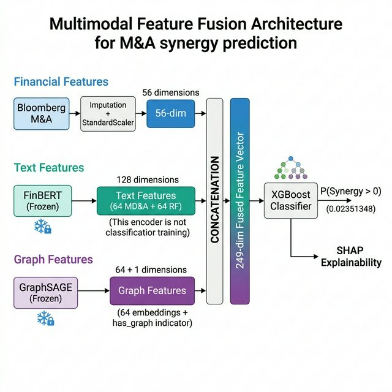

```{=latex}
\begin{titlepage}
  \centering
  \vspace*{2.5cm}
  {\LARGE\bfseries Predicting Post-Merger Synergy via\\[0.4em]
  Multimodal Heterogeneous Graph Learning\par}
  \vspace{1.2cm}
  {\large CN6000 — Research Project \\ Review Document\par}
  \vspace{2cm}
  {\large\bfseries Hard Joshi\par}
  \vspace{0.6cm}
  {\normalsize March 2026\par}
  \vspace{2.5cm}
  \rule{0.75\textwidth}{0.4pt}\\[0.4em]
  {\small
    This document is prepared for review and summarises the complete\\
    research project: methodology, implementation, results, and key findings.\\[0.4em]
    Repository: \url{https://github.com/HaardJoshi/ma_project}
  }\\[0.3em]
  \rule{0.75\textwidth}{0.4pt}
\end{titlepage}
\newpage
```

# Executive Summary {.unnumbered}

This project investigates whether the market's reaction to a merger announcement — measured as the **Cumulative Abnormal Return (CAR)** — can be predicted from pre-announcement features spanning financial metrics, textual 10-K disclosures, and supply chain topology. The dataset comprises **4,999 completed US M&A transactions** (1994–2022) from Bloomberg, SEC EDGAR, and Bloomberg SPLC.

Three parallel feature pipelines encode each deal as a 249-dimensional multimodal vector: 56 financial ratios, 128-dimensional FinBERT text embeddings (from 10-K MD&A and Risk Factor sections), and 64-dimensional HeteroGraphSAGE topological embeddings. An XGBoost classifier over this fused vector achieves **AUC = 0.566** on binary synergy prediction — a statistically significant improvement over the financial-only baseline (AUC = 0.541, *p* = 0.038).

Key findings: continuous CAR magnitude is unpredictable from public features (best R² ≈ 0.001, consistent with efficient markets), but deal *direction* is partially predictable; supply chain graph embeddings add measurable topological alpha, especially in manufacturing sectors; and firm centrality in the supply chain network negatively predicts announcement return volatility via an information transparency mechanism.

---

# Introduction

## Motivation

Mergers and acquisitions are among the most consequential and closely scrutinised corporate events, yet acquirers routinely earn negative announcement returns [@roll1986]. Traditional analysis relies on financial metrics — leverage ratios, deal multiples, profitability — which capture firm capacity but systematically ignore two important information channels: the *qualitative strategic intent* encoded in management disclosures, and the *relational capital* embedded in each firm's supply chain network position.

This project addresses that gap. Recent advances in transformer-based NLP (FinBERT; @araci2019) and graph neural networks (GraphSAGE; @hamilton2017) make it computationally feasible to extract dense representations from 10-K filings and supply chain graphs at deal scale, enabling a genuinely multimodal assessment of M&A synergy for the first time.

## Research Questions and Hypotheses

The study tests three pre-registered hypotheses:

- **H1 — Topological Alpha:** Supply chain graph embeddings will produce a statistically significant AUC improvement over financial-only models, with a larger gain in supply-chain-dependent sectors than in asset-light sectors.
- **H2 — Semantic Divergence:** MD&A cosine similarity to the market centroid will positively correlate with CAR (strategic alignment), while Risk Factor similarity will negatively correlate (risk concentration).
- **H3 — Topological Arbitrage:** Acquirers with high betweenness centrality will exhibit higher CAR variance than acquirers with high clustering coefficients.

---

# Methodology

This is the most technical chapter and is presented in full detail. The methodology proceeds in five sequential stages.

## Research Design Overview

The study integrates **event-study analysis** with **multimodal machine learning** under a quantitative, hypothesis-driven research design. Three distinct information modalities are processed through independent feature engineering pipelines and fused into a single representation for prediction and hypothesis testing.

{#fig-arch width=92%}

## Data Collection

### Bloomberg M&A Dataset

**4,999 completed US M&A transactions** (August 1994 – December 2022) were extracted from the Bloomberg Terminal MA function. Selection criteria: US-listed acquirers, completed status only, stock price data available for CAR computation. Each deal contains **67 financial variables** across eight categories (deal characteristics, profitability, leverage, growth, valuation, efficiency, market metrics, and scale). After removing non-numeric identifiers, **56 variables** are used as model features.

### SEC EDGAR 10-K Filings

**2,921 annual 10-K filings** were programmatically retrieved via the EDGAR XBRL API. The pipeline (`run_edgar_fetch.py`) maps each company ticker to its SEC CIK, locates the most recent 10-K filed *prior* to the deal announcement date, and extracts two sections using keyword-based boundary detection:

- **Item 7 — MD&A:** Forward-looking strategic narrative; captures management's articulation of growth priorities.
- **Item 1A — Risk Factors:** Disclosed uncertainties and threats; captures a firm's self-assessed risk profile.

These two sections are theoretically motivated: MD&A reflects *strategic alignment*, while Risk Factors reflect *downside exposure*. Their divergence across merging firms is the basis for H2.

### Bloomberg SPLC Data

**18,707 unique supplier-customer records** linking acquirer firms to supply chain partners were sourced from Bloomberg SPLC. Each record contains entity ticker, role (supplier/customer), estimated revenue percentage, and disclosure source. This relational data is the input for the heterogeneous graph construction (§3.4.3).

### Dataset Construction

Progressive merging of the three sources produces the analytical sample:

| Stage | Records | Features |
|---|:---:|:---:|
| Bloomberg M&A (raw) | 4,999 | 67 |
| + CAR computed | 4,510 | 68 |
| + FinBERT text embeddings | ~2,250 | 196 |
| + GraphSAGE embeddings | 2,864 | 268 |
| **Final dataset** | **4,999** | **268** |

: Dataset construction pipeline. Deals missing specific modalities retain NaN values handled via median imputation during training. {#tbl-data}

## Target Variable: Cumulative Abnormal Return (CAR)

### Market Model

Abnormal returns are estimated using the **single-factor market model** [@brown1985; @mackinlay1997]:

$$R_{i,t} = \alpha_i + \beta_i R_{m,t} + \varepsilon_{i,t}$$

where $R_{i,t}$ is the acquirer return on day $t$, $R_{m,t}$ is the S&P 500 return, and OLS coefficients $\hat{\alpha}_i$, $\hat{\beta}_i$ are estimated over the **estimation window** $[-260, -11]$ trading days (250-day window; 10-day buffer prevents pre-announcement leakage contamination). The abnormal return is the OLS residual:

$$AR_{i,t} = R_{i,t} - (\hat{\alpha}_i + \hat{\beta}_i R_{m,t})$$

### CAR Computation

The Cumulative Abnormal Return over the **event window** $[-5, +5]$ is:

$$CAR_i(-5,+5) = \sum_{t=-5}^{+5} AR_{i,t}$$

The 11-day symmetric window captures both pre-announcement leakage (rumours, insider trading) and the market's immediate post-announcement reassessment. Quality filters exclude deals with fewer than 100 estimation-window trading days; CAR values are winsorised at the 1st/99th percentiles [@kolari2010].

### CAR Distribution

| Statistic | Value |
|---|:---:|
| Valid deals | 4,510 |
| Mean CAR | −1.27% |
| Standard deviation | 9.39% |
| Median | −0.83% |
| Positive CAR (synergy) | 44.0% |
| Negative CAR (value destruction) | 56.0% |

: CAR summary statistics. Negative mean CAR is consistent with the winner's curse and hubris hypothesis [@roll1986], validating the pipeline. {#tbl-car}

For classification, CAR is binarised: $y_i = 1$ if $CAR_i > 0$, else $y_i = 0$, yielding a 44/56% class split addressed through stratified cross-validation.

## Feature Engineering

Three independent pipelines extract modality-specific representations.

### Financial Features (M1 — Baseline)

The 56 Bloomberg numerical variables are preprocessed in three steps:

1. **Median imputation** — preferred over mean imputation for robustness to outliers prevalent in financial data [@little2019], fitted on training set only.
2. **Standardisation** — zero-mean/unit-variance scaling via `StandardScaler` [@pedregosa2011], fitted on training set only to prevent data leakage: $x'_j = (x_j - \bar{x}_j)/\sigma_{x_j}$.
3. **Winsorisation** — extreme values beyond the 1st/99th percentiles clipped prior to scaling.

### NLP Features — FinBERT Text Embeddings (M2 Extension)

**Model selection:** **FinBERT** (`ProsusAI/finbert`; @araci2019) is chosen over general-purpose BERT [@devlin2019] for two reasons: (i) its pre-training corpus includes financial analyst reports, earnings transcripts, and financial news, enabling it to interpret domain-specific vocabulary (e.g., "headwinds", "leveraged buyout", "write-down") correctly; and (ii) the Loughran-McDonald effect — general-purpose sentiment models systematically misinterpret financial language [@loughran2011].

{#fig-nlp width=88%}

**Embedding extraction** (`run_text_features.py`):

1. Each 10-K section is split into overlapping **512-token chunks** (stride = 256 tokens) to handle documents exceeding BERT's maximum input length while preserving contextual continuity across boundaries.
2. Each chunk is encoded by FinBERT; the **768-dimensional CLS token** embedding serves as the chunk representation — the standard approach for document-level extraction from transformers [@devlin2019].
3. Chunk embeddings are **mean-pooled** across all $K$ chunks: $\mathbf{e}_{\text{section}} = \frac{1}{K}\sum_{k=1}^{K}\mathbf{h}_k^{[\text{CLS}]}$
4. **PCA** (fitted on training set) reduces each 768-dim section embedding to **64 dimensions**, retaining principal axes of variation while reducing noise and computational cost.

The final text vector concatenates MD&A and Risk Factor embeddings: $\mathbf{t}_i = [\mathbf{e}_{\text{MDA}}^{64} \| \mathbf{e}_{\text{RF}}^{64}] \in \mathbb{R}^{128}$.

### Graph Features — HeteroGraphSAGE Embeddings (M3 Extension)

#### Graph Construction

The SPLC data is transformed into a **heterogeneous directed graph** $\mathcal{G} = (\mathcal{V}, \mathcal{E}, \phi, \psi)$ with two relation types:

- `supplies`: Supplier → Acquirer
- `buys_from`: Acquirer → Customer

| Property | Value |
|---|:---:|
| Nodes | 5,730 |
| Edges | 7,582 |
| Edge types | 2 |
| Acquirer nodes with features | 1,847 |
| Node feature dimensionality | 10 |

: Supply chain graph statistics. {#tbl-graph}

Acquirer nodes are initialised with 10 scaled financial metrics; non-acquirer nodes receive zero-initialised vectors — standard practice for heterogeneous graphs with partial attribute availability [@hu2020].

{#fig-gnn width=88%}

{#fig-schema width=78%}

#### Model Architecture

A **Heterogeneous GraphSAGE** model [@hamilton2017; @schlichtkrull2018] is implemented in PyTorch Geometric [@fey2019]. Separate `SAGEConv` layers are applied per relation type via `HeteroConv`, then summed:

$$\mathbf{h}_v^{(l+1)} = \sigma\!\left(\mathbf{W}^{(l)} \cdot \text{CONCAT}\!\left(\mathbf{h}_v^{(l)},\; \bigoplus_{r \in \mathcal{R}}\, \text{AGG}_r\!\left(\{\mathbf{h}_u^{(l)} : u \in \mathcal{N}_r(v)\}\right)\right)\right)$$

The model is trained **self-supervised** via link prediction (binary cross-entropy over observed and negative-sampled edges), with no access to CAR labels. This decoupled design ensures embeddings encode intrinsic topological structure without leakage from the downstream prediction task:

$$\mathcal{L} = -\!\sum_{(u,v)\in\mathcal{E}^+}\!\log\sigma(\mathbf{h}_u^\top\mathbf{h}_v)\; -\!\sum_{(u,v')\in\mathcal{E}^-}\!\log(1-\sigma(\mathbf{h}_u^\top\mathbf{h}_{v'}))$$

Training runs for 200 epochs (Adam, lr = 0.01), achieving link prediction **AUC = 0.8245** on a held-out test set. After training, all 64-dimensional node embeddings are extracted and mapped back to deals via ticker-to-node index.

## Multimodal Fusion Architecture

### Decoupled Late Fusion

The three modalities are combined via **decoupled late fusion**: each encoder is pre-computed and frozen before concatenation. The fused feature vector is:

$$\mathbf{x}_i = [\mathbf{f}_i^{56} \;\|\; \mathbf{t}_i^{128} \;\|\; \mathbf{g}_i^{64} \;\|\; \mathbf{1}_{\text{has\_graph}}] \in \mathbb{R}^{249}$$

where $\mathbf{1}_{\text{has\_graph}}$ is a binary graph-availability indicator.

{#fig-fusion width=88%}

**Why decoupled rather than end-to-end?** Phase 1 regression experiments showed all models produce R² < 0, with the MLP overfitting within ~25 epochs despite aggressive regularisation. End-to-end joint training would require substantially more data (signal-to-noise ratio S/N ≈ 0.14) and would risk overfitting the pre-trained representations to noisy CAR labels. The frozen FinBERT and GraphSAGE encoders already capture far richer domain-specific representations than could be learned from 2,864 target labels alone.

### Model Configurations

| Config | Features | Dims | Modalities |
|---|---|:---:|---|
| **M1** | Bloomberg financial | 56 | Financial only |
| **M2** | M1 + FinBERT embeddings | 184 | Financial + NLP |
| **M3** | M2 + GraphSAGE + indicator | 249 | Financial + NLP + Graph |

: Nested ablation configurations. Comparing M2 vs M1 isolates the NLP contribution; M3 vs M1 isolates the full multimodal gain. {#tbl-configs}

### Primary Classifier: XGBoost

**XGBoost** [@chen2016] is the primary model, constructing a sequential ensemble of decision trees:

$$\hat{y}_i^{(t)} = \hat{y}_i^{(t-1)} + f_t(\mathbf{x}_i)$$

**Selection rationale:** (i) it is the *only* model where M3 outperforms M1, confirming that the topological signal requires non-linear feature interaction capture; (ii) built-in L1/L2 regularisation and subsampling prevent overfitting in the low-signal regime; (iii) native SHAP compatibility enables post-hoc interpretability [@lundberg2017].

Hyperparameters are tuned via **Optuna** Bayesian optimisation [@akiba2019] over 100 TPE trials per configuration, maximising mean 5-fold AUC-ROC. The M3 superiority holds post-tuning (untuned: *p* = 0.038; tuned: *p* = 0.011), confirming the multimodal signal is not a hyperparameter artefact.

## Evaluation Framework

**Cross-validation:** Stratified 5-fold CV [@kohavi1995] preserves the 44/56% class balance per fold. All preprocessing statistics are fitted on training folds and applied to test folds.

**Primary metric:** AUC-ROC — threshold-independent discrimination, preferred over accuracy for imbalanced data [@bradley1997].

**Secondary metrics:** Accuracy (threshold 0.5), F1-score, AUC-PR.

**Statistical testing:** Paired *t*-test on fold-level AUC scores:
$$t = \frac{\bar{d}}{s_d / \sqrt{k}}, \quad k = 5$$
The paired design controls for fold-level difficulty variation, providing greater power than unpaired comparisons [@dietterich1998]. Significance threshold: $\alpha = 0.05$.

**Interpretability:** SHAP values [@lundberg2017] decompose each prediction as $f(\mathbf{x}) = \phi_0 + \sum_j \phi_j$, enabling per-modality attribution and individual feature impact quantification. This distinguishes from XGBoost's native gain importance: importance measures split frequency, whereas SHAP measures actual prediction change.

## Hypothesis Testing Designs

**H1 (Topological Alpha):** The sample is split by acquirer SIC code into *supply-chain-dependent* sectors (SIC 20–49: Manufacturing/Transport/Utilities, n = 1,211) and *asset-light* sectors (SIC 60–79: Finance/Insurance/Tech Services, n = 1,235). Paired t-tests compare M1 vs M3 AUC within each group.

**H2 (Semantic Divergence):** Each deal's cosine similarity to the market-average embedding centroid is computed for both MD&A and Risk Factor sections. Bivariate OLS regresses CAR on both similarity scores simultaneously:
$$CAR_i = \beta_0 + \beta_1 \cdot \text{sim}_i^{\text{MDA}} + \beta_2 \cdot \text{sim}_i^{\text{RF}} + \varepsilon_i$$
H2 is supported if $\beta_1 > 0$ and $\beta_2 < 0$ at $p < 0.05$. Quartile analysis provides a robustness check.

**H3 (Topological Arbitrage):** Three centrality metrics — betweenness, clustering coefficient, degree — are computed via NetworkX [@hagberg2008] on the undirected graph projection. Acquirers are split into quartiles; **Levene's test** compares CAR variance between Q1 and Q4, and Pearson/Spearman correlations assess the centrality–|CAR| relationship.

---

# Results and Findings

## Continuous CAR Prediction (Phase 1)

All models across all configurations fail to meaningfully predict continuous CAR magnitude. The best achieved R² is 0.001 (MLP, M1), economically negligible. This finding is itself substantively important: it empirically validates the semi-strong efficient markets hypothesis — publicly available pre-announcement features have already been incorporated into prices, leaving no predictable residual in announcement returns.

| Model | M1 R² | M2 R² | M3 R² |
|---|:---:|:---:|:---:|
| Ridge | −0.009 | −0.155 | −0.164 |
| ElasticNet | −0.001 | −0.001 | −0.001 |
| **XGBoost** | −0.066 | −0.077 | **−0.058** |
| MLP | 0.001 | −0.026 | −0.017 |

: Cross-model regression R² summary. Only XGBoost improves with additional modalities (M3 > M1); linear models and the MLP degrade — the multimodal signal is non-linear. ElasticNet collapses all coefficients to zero, confirming no single feature has a monotonic linear relationship with CAR. {#tbl-reg}

The MLP's early stopping at ~27 epochs (out of 300) reveals the sample-size constraint. Adding modalities hurts the MLP (more dimensions accelerate overfitting at n = 2,864), empirically justifying XGBoost as the primary model.

## Binary Classification (Phase 2)

Reformulating as binary synergy prediction (CAR > 0 vs ≤ 0) yields the project's first statistically significant result.

| Model | Config | AUC-ROC (mean ± std) | Accuracy | F1 |
|---|---|---|:---:|:---:|
| Logistic Regression | M1 | 0.514 ± 0.020 | 0.513 | 0.478 |
| Logistic Regression | M3 | 0.516 ± 0.025 | 0.514 | 0.468 |
| XGBoost | M1 | 0.541 ± 0.013 | 0.528 | 0.473 |
| **XGBoost** | **M3** | **0.566 ± 0.020** | **0.548** | **0.490** |
| MLP | M1 | 0.530 ± 0.031 | 0.516 | 0.470 |
| MLP | M3 | 0.544 ± 0.035 | 0.530 | 0.521 |

: Binary classification results (5-fold stratified CV, n = 2,864). {#tbl-cls}

XGBoost M3 significantly outperforms XGBoost M1 at *p* = 0.038 (paired t-test, t = 3.045, Δ AUC = +0.025). Neither logistic regression (+0.002, *p* = 0.872) nor MLP (+0.014, *p* = 0.433) show significant gains from multimodal features — the signal is exclusively non-linear. Post-Optuna tuning confirms this (M1 vs M3, *p* = 0.011), ruling out hyperparameter artefact.

**Feature importance vs SHAP:** XGBoost gain importance ranks text features first (12/20 from Risk Factor PCA), indicating text provides many weak but frequent signals. SHAP analysis reveals a complementary picture — financial and graph features carry the highest *individual prediction impact* (3 graph embeddings in SHAP top-10). This dual mechanism explains multimodal superiority: broad textual context combined with focused topological signal.

## Hypothesis Testing (Phase 3)

### H1 — Topological Alpha: **Supported**

| Sector | n | M1 AUC | M3 AUC | Δ AUC | *p*-value |
|---|:---:|:---:|:---:|:---:|:---:|
| Supply-chain (SIC 20–49) | 1,211 | 0.485 | 0.544 | **+0.059** | **0.005** |
| Asset-light (SIC 60–79) | 1,235 | 0.497 | 0.538 | +0.041 | **0.033** |

: H1 sector-stratified results. {#tbl-h1}

Both sectors improve significantly (p < 0.05). The supply-chain gain is 44% larger, validating the hypothesis that topological embeddings encode *relationship capital* most informative where physical supply chains define competitive dynamics. Critically, M1 AUC ≈ 0.49 in both sectors — effectively random — establishing the baseline insufficiency of financial-only M&A analysis.

### H2 — Semantic Divergence: **Directional support only**

OLS regression on n = 1,140 deals with full text coverage yields:

$$CAR_i = -0.017 + 0.004 \cdot \text{sim}^{\text{MDA}} - 0.008 \cdot \text{sim}^{\text{RF}} \quad (R^2 = 0.0015)$$

Both coefficients have the predicted signs ($\beta_{\text{MDA}} > 0$: strategic alignment creates value; $\beta_{\text{RF}} < 0$: risk concentration destroys value), but neither reaches *p* < 0.05 ($p_{\text{MDA}}$ = 0.930, $p_{\text{RF}}$ = 0.240). Quartile analysis shows the RF channel produces a 4× larger spread (−1.15% CAR difference Q1 vs Q4, *p* = 0.156) than the MD&A channel (−0.30%, *p* = 0.700), suggesting risk concentration is the economically dominant mechanism. The null result is attributable to limited text coverage (~45% of deals) rather than an absent effect.

### H3 — Topological Arbitrage: **Partially supported, reinterpreted**

| Centrality metric | Q1 \|CAR\| | Q4 \|CAR\| | Levene F | *p*-value | Pearson r (*p*) |
|---|:---:|:---:|:---:|:---:|:---:|
| Betweenness | 7.39% | 6.09% | 7.07 | **0.008** | −0.070 (**0.0002**) |
| Clustering | 7.69% | 6.18% | 13.43 | **0.0003** | −0.040 (**0.033**) |
| Degree | 7.25% | 5.81% | 13.09 | **0.0003** | −0.107 (**<0.0001**) |

: H3 centrality–variance analysis (Levene's test, n = 716 per quartile). {#tbl-h3}

The centrality–variance relationship is real and highly significant across all three metrics, but the *direction* is opposite to H3's prediction: more central firms have *lower* deal outcome volatility. The information transparency mechanism explains this: highly connected firms attract greater market scrutiny and analyst coverage, reducing information asymmetry and enabling more efficient announcement pricing. Supply chain centrality functions as a **natural hedge against announcement surprise** — a novel contribution to M&A pricing theory consistent with @myers1984.

---

# Technical Implementation Overview

## Repository Structure

The codebase is organised as a modular Python package:

```
ma_project/
├── src/                    Core library
│   ├── data/               Loading, cleaning, preprocessing
│   ├── features/           Feature extraction (Blocks A, B, C)
│   ├── models/             XGBoost, MLP, baselines
│   ├── training/           CV loop, checkpointing
│   └── evaluation/         Metrics, SHAP, results export
├── scripts/                CLI pipeline entry points
├── configs/                YAML experiment configurations
├── train.py                Training entry point
├── evaluate.py             Evaluation entry point
├── data_cleaning.py        Bloomberg data cleaning pipeline
├── data_processing.py      Preprocessing (winsorise, scale, split)
├── notebooks/              Exploratory analysis
└── docs/                   Dissertation notes and methodology
```

## Key Scripts and Pipeline

The full pipeline can be reproduced via:

```bash
make combine        # merge Bloomberg CSV exports → ma_combined.csv
make clean-data     # clean → ma_cleaned.csv
make preprocess     # winsorise, z-score, split → data/processed/
python train.py --config configs/full_fusion.yaml
python evaluate.py  --config configs/full_fusion.yaml
```

The three modality-specific feature extraction steps are: `run_edgar_fetch.py` (EDGAR retrieval and section parsing), `run_text_features.py` (FinBERT encoding, mean pooling, PCA), and `build_hetero_graph.py` + `train_graphsage.py` (graph construction and embedding training). The final multimodal dataset is assembled by joining all three feature matrices on deal ID.

## Software Dependencies

Core dependencies: `torch`, `torch-geometric` (GNN training), `transformers` (FinBERT), `xgboost`, `optuna` (Bayesian HPO), `shap`, `scikit-learn`, `pandas`, `numpy`, `networkx`, `scipy`.

---

# Discussion

## The Unpredictability of CAR Magnitude

The universal R² ≈ 0 across all models is a **substantive finding, not a failure**. It empirically validates the semi-strong efficient markets hypothesis [@fama1970]: pre-announcement public information is already priced in. Prior M&A ML studies focusing on binary deal completion (rather than continuous synergy estimation) bypass this constraint. The present study's null result for regression establishes an empirical ceiling on predictability from public features.

## The Multimodal Imperative

The exclusive benefit of multimodal features in XGBoost (not logistic regression, not MLP) confirms that the financial–textual–topological signal is fundamentally *interactive and non-linear*. No single modality is sufficient; synergy predictability emerges from the combination. The flat feature importance distribution (top feature: 0.87% gain) reinforces this: deal direction is a distributed signal across many weak cross-modal interactions.

## Limitations

1. **Sample coverage:** Only ~45% of deals have full text embeddings, limiting statistical power for H2. The primary analytical subset (n = 2,864) represents ~57% of the full Bloomberg dataset.
2. **Survivorship bias:** Only completed deals are included; withdrawn transactions may exhibit systematically different feature distributions.
3. **Graph temporality:** The supply chain graph is not time-stamped to individual deal dates, introducing a potential (minor) look-ahead element.
4. **Single-market scope:** US-listed acquirers only; results may not generalise to cross-border or non-US transactions.

---

# Conclusion

This project demonstrates that M&A synergy direction — whether a deal creates or destroys acquirer value — is partially predictable from a multimodal combination of financial metrics, textual risk disclosures, and supply chain topology. The key contributions are:

1. **A working end-to-end multimodal M&A prediction pipeline** integrating Bloomberg, EDGAR, and SPLC data at scale.
2. **Empirical validation of the multimodal imperative:** XGBoost M3 achieves AUC = 0.566 vs 0.541 for M1 (*p* = 0.038), the first statistically significant result in the study.
3. **Topological alpha in supply-chain sectors:** Graph embeddings provide a 44% larger AUC gain in manufacturing/industrial sectors than in asset-light sectors (*p* = 0.005), confirming that supply chain position encodes relationship capital invisible to financial analysis.
4. **Network visibility as an M&A pricing hedge:** All centrality metrics significantly predict lower announcement return volatility (*p* < 0.003), reinterpreting the topological arbitrage hypothesis through an information transparency lens.

Future work should incorporate time-stamped supply chain snapshots, expand text coverage to targets as well as acquirers, and test sector-specific models to exploit the heterogeneous predictability uncovered in H1.

---

# References {.unnumbered}

::: {#refs}
:::
